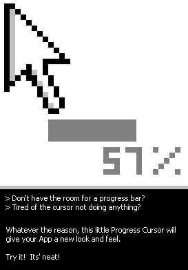



## Cursor Progress Bar

### Description

Displays the progress on a cursor. It doesn't seem to work on W95/98 machines, I apologize for that. I have developed this on a Win2K and never tested it on other versions of windows. If anyone gets it to work on 95/98, let me know. :)
 
### More Info
 
A value, between Min and Max of the specified range.

Just run it in the group project mode to see it...

You will be able to figure out how to use it.

The output is visual through display of a cursor with a progress and percentage.

none known

             |
---                |---
**Submitted On**   |2002-07-16 15:07:34
**By**             |[Rick Ilyasov](https://github.com/Planet-Source-Code/PSCIndex/blob/master/ByAuthor/rick-ilyasov.md)
**Level**          |Advanced
**User Rating**    |4.4 (96 globes from 22 users)
**Compatibility**  |VB 6\.0
**Category**       |[Custom Controls/ Forms/  Menus](https://github.com/Planet-Source-Code/PSCIndex/blob/master/ByCategory/custom-controls-forms-menus__1-4.md)
**World**          |[Visual Basic](https://github.com/Planet-Source-Code/PSCIndex/blob/master/ByWorld/visual-basic.md)
**Archive File**   |[Cursor\_Pro1068957162002\.zip](https://github.com/Planet-Source-Code/rick-ilyasov-cursor-progress-bar__1-36958/archive/master.zip)

